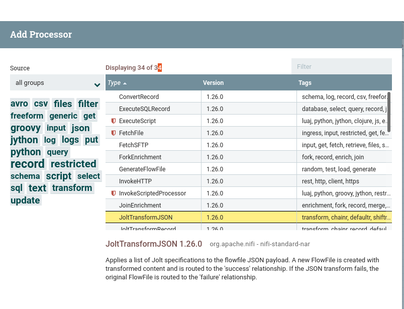
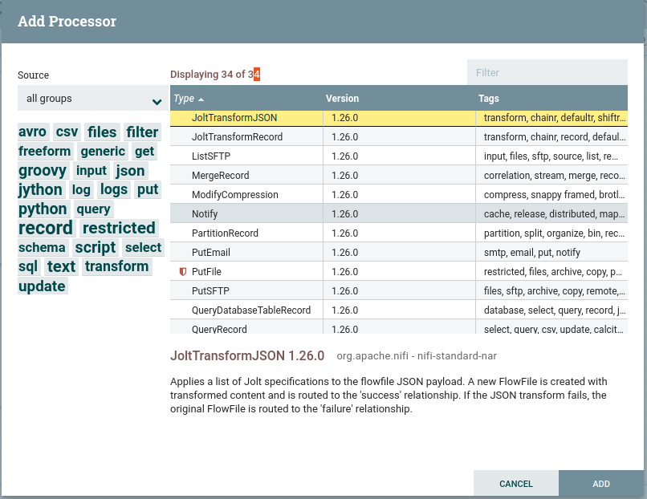
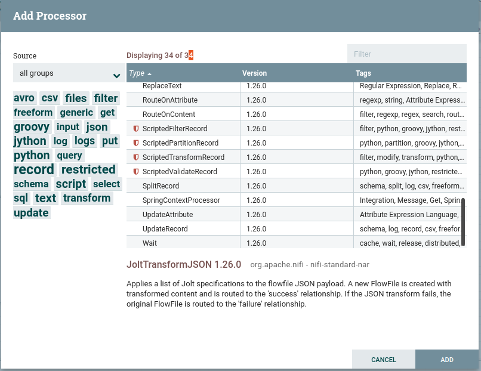

# Task: Install NiFi Core with a Limited Set of Processors

**We Need Only These Processors:**
- GenerateFlowFile
- ListSFTP
- FetchSFTP
- PutSFTP
- PutEmail
- FetchFile
- PutFile
- ExecuteSQLRecord
- QueryDatabaseTableRecord
- JoltTransformJSON
- JoltTransformRecord
- UpdateAttribute
- UpdateRecord
- RouteOnAttribute
- RouteOnContent
- PartitionRecord
- SplitRecord
- MergeRecord
- ForkEnrichment
- JoinEnrichment
- QueryRecord
- ConvertRecord
- InvokeHTTP
- ReplaceText
- Wait
- Notify
- ExecuteScript

## A) Shortcut Approach
Just download and paste this folder => `nifi-1.26.0-source-release` where NiFi is installed. It will replace all necessary `pom.xml` files and remove the processors not needed.

## B) Detailed Approach from Scratch

0. Download the source code from the official website: [NiFi 1.26.0 Source](https://nifi.apache.org/download/)

1. Go to the root `pom.xml` path: `nifi-1.26.0-source-release/nifi-1.26.0/pom.xml`
   - Remove unnecessary modules from `pom.xml`:
     ```xml
     <module>nifi-docs</module>
     <module>nifi-docker</module>
     <module>minifi</module>
     <module>c2</module>
     <module>nifi-h2</module>
     ```

2. Go to `nifi-1.26.0-source-release/nifi-1.26.0/nifi-assembly/pom.xml`
   - Remove unnecessary NAR dependencies that we don't need:
     ```xml
     nifi-tcp-nar, nifi-gcp-nar, nifi-stateful-analysis-nar, nifi-cdc-mysql-nar, nifi-parquet-nar,
     nifi-pgp-nar, nifi-hwx-schema-registry-nar, nifi-asana-processors-nar, nifi-hadoop-libraries-nar,
     nifi-hadoop-nar, nifi-kafka-1-0-nar, nifi-kafka-2-0-nar, nifi-kafka-2-6-nar, nifi-confluent-platform-nar,
     nifi-html-nar, nifi-poi-nar, nifi-kudu-nar, nifi-kerberos-iaa-providers-nar, nifi-hadoop-dbcp-service-nar,
     nifi-mongodb-nar, nifi-mongodb-services-nar, nifi-solr-nar, nifi-social-media-nar, nifi-hl7-nar, nifi-ccda-nar,
     nifi-language-translation-nar, nifi-enrich-nar, nifi-geohash-nar, nifi-aws-nar, nifi-ambari-nar, nifi-rethinkdb-nar,
     nifi-network-processors-nar, nifi-avro-nar
     ```

3. Remove processors individually from each NAR we need, as we need only selected processors from NAR:

   - For selected processors under standard processors, go to file:
     `nifi-1.26.0-source-release/nifi-1.26.0/nifi-nar-bundles/nifi-standard-bundle/nifi-standard-processors/src/main/resources/META-INF/services/org.apache.nifi.processor.Processor`
     - Paste:
       ```plaintext
       org.apache.nifi.processors.standard.GenerateFlowFile
       org.apache.nifi.processors.standard.ListSFTP
       org.apache.nifi.processors.standard.FetchSFTP
       org.apache.nifi.processors.standard.PutSFTP
       org.apache.nifi.processors.standard.PutEmail
       org.apache.nifi.processors.standard.FetchFile
       org.apache.nifi.processors.standard.PutFile
       org.apache.nifi.processors.standard.ExecuteSQLRecord
       org.apache.nifi.processors.standard.QueryDatabaseTableRecord
       org.apache.nifi.processors.standard.JoltTransformJSON
       org.apache.nifi.processors.standard.UpdateRecord
       org.apache.nifi.processors.standard.RouteOnAttribute
       org.apache.nifi.processors.standard.RouteOnContent
       org.apache.nifi.processors.standard.PartitionRecord
       org.apache.nifi.processors.standard.SplitRecord
       org.apache.nifi.processors.standard.MergeRecord
       org.apache.nifi.processors.standard.ForkEnrichment
       org.apache.nifi.processors.standard.JoinEnrichment
       org.apache.nifi.processors.standard.QueryRecord
       org.apache.nifi.processors.standard.ConvertRecord
       org.apache.nifi.processors.standard.InvokeHTTP
       org.apache.nifi.processors.standard.ReplaceText
       org.apache.nifi.processors.standard.Wait
       org.apache.nifi.processors.standard.Notify
       ```

   - For Jolt-related processors only, go to file:
     `nifi-1.26.0-source-release/nifi-1.26.0/nifi-nar-bundles/nifi-jolt-record-bundle/nifi-jolt-record-processors/src/main/resources/META-INF/services/org.apache.nifi.processor.Processor`
     - Paste:
       ```plaintext
       org.apache.nifi.processors.jolt.record.JoltTransformRecord
       ```

   - For scripting-related processors only, go to file:
     `nifi-1.26.0-source-release/nifi-1.26.0/nifi-nar-bundles/nifi-scripting-bundle/nifi-scripting-processors/target/classes/META-INF/services/org.apache.nifi.processor.Processor`
     - Paste:
       ```plaintext
       org.apache.nifi.processors.script.ExecuteScript
       ```

   - For UpdateAttribute processor, go to file:
     `nifi-1.26.0-source-release/nifi-1.26.0/nifi-nar-bundles/nifi-update-attribute-bundle/nifi-update-attribute-processor/src/main/resources/META-INF/services/org.apache.nifi.processor.Processor`
     - Paste:
       ```plaintext
       org.apache.nifi.processors.attributes.UpdateAttribute
       ```

4. All set! Go to the directory path:
   ```bash
   /home/vijay/Desktop/nifi-1.26.0-source-release/nifi-1.26.0
   ```

- Run following Command :
```bash
mvn clean install -pl nifi-assembly -am
bin/nifi.sh restart

```

5. OUTPUT :<br><br>

 <br><br>
 <br><br>
 <br><br>

